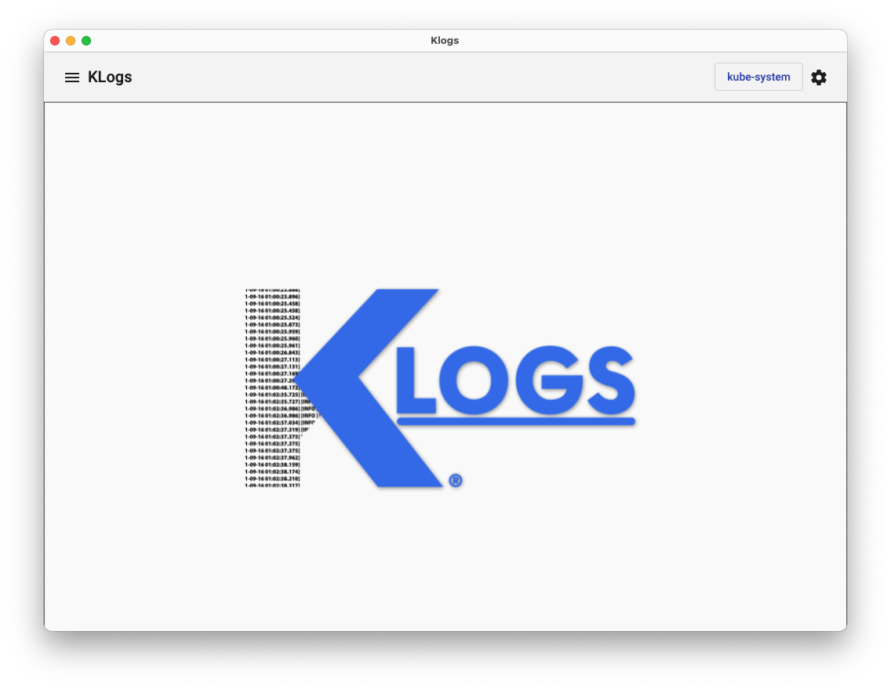
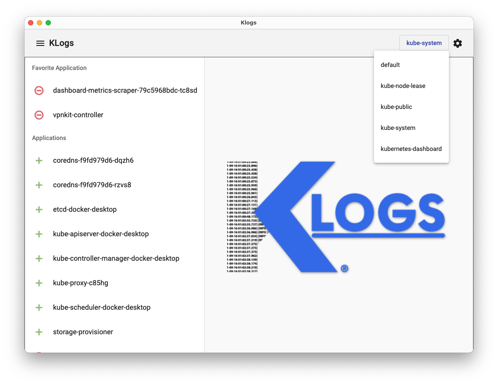
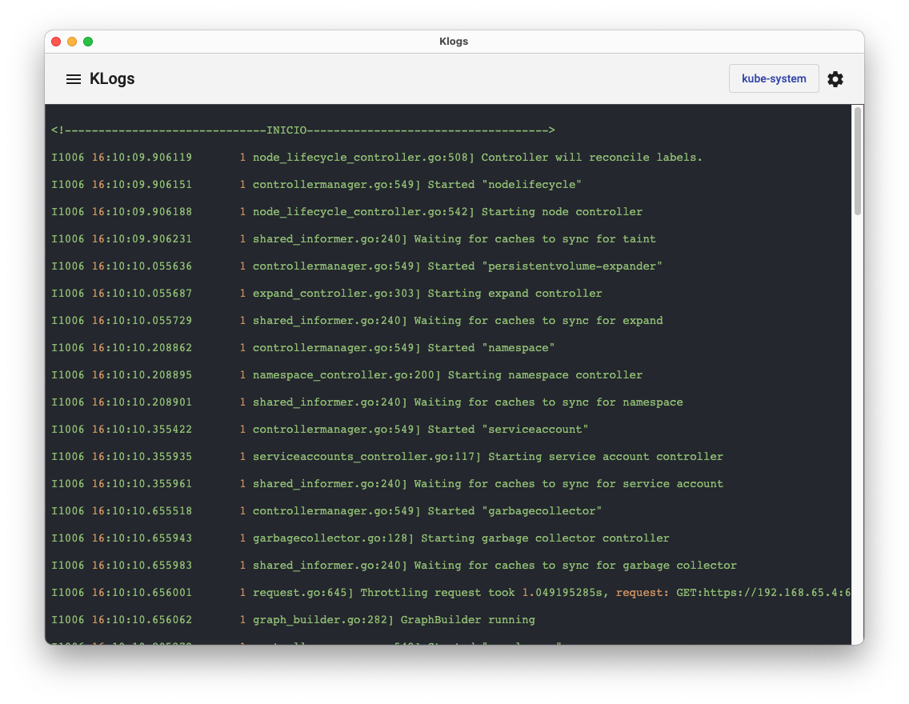
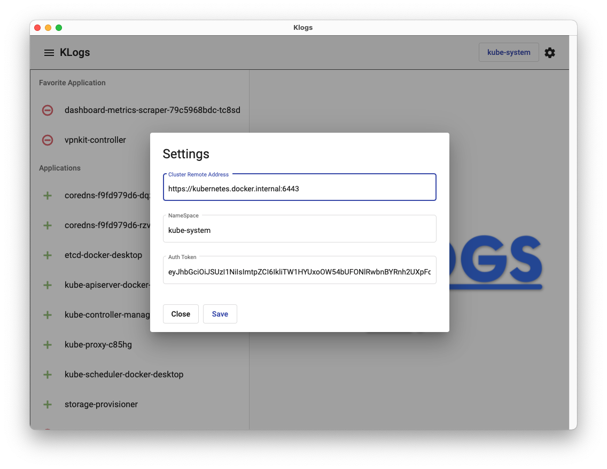

# KLogs

This project was generated with [Angular CLI](https://github.com/angular/angular-cli) version 12.2.7 And Electron [Electron](https://www.electronjs.org) version 6.0.0-beta.61


## How to get data to fill the settings

### Cluster Server (Fill In `Cluster Remote Address`)
```shell
kubectl config view -o jsonpath="{.clusters[?(@.name==\"docker-desktop\")].cluster.server}"
```

### Token (Fill In `Auth Token`)
```shell
kubectl get secrets -o jsonpath="{.items[?(@.metadata.annotations['kubernetes\.io/service-account\.name']=='default')].data.token}" | base64 -d
```

### Home


### Screen With Menu Opened
>Screen that show the menu opened with the list of pods in the selected namespace in toolbar beside of settings icon, when we select an item in the menu the sidebar closes and the log of the pod selected shows.


### Screen With Toolbar Namespaces Menu Opened
>Screen that show the menu in the toolbar opened with the list of namespaces in the cluster, when we select the namespace the sidebar open and show the list of pods that belongs the namespace selected.



### Screen Log View
>Screen that show the settings and configurations to connect to the cluster



### Screen Settings
>Screen that show the log view of pod selected


